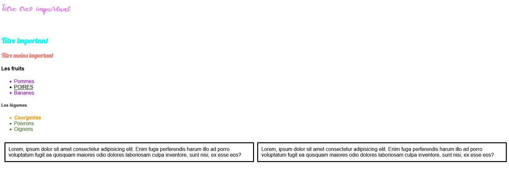

# Les flexbox

Faire ce cours là : https://openclassrooms.com/fr/courses/1603881-apprenez-a-creer-votre-site-web-avec-html5-et-css3/3298561-faites-votre-mise-en-page-avec-flexbox

 
Faire tous les cours sur les flexbox et ensuite faire ce jeu : http://flexboxfroggy.com/#fr

 

## Créer deux paragraphes avec du texte lorem ipsum

A toi de voir comment faire pour tout le reste

## Créer une bordure solide autour des paragraphes

## Créer une marge intérieure de 10 px et une marge extérieure gauche de 10px 

# Résultat attendu 

